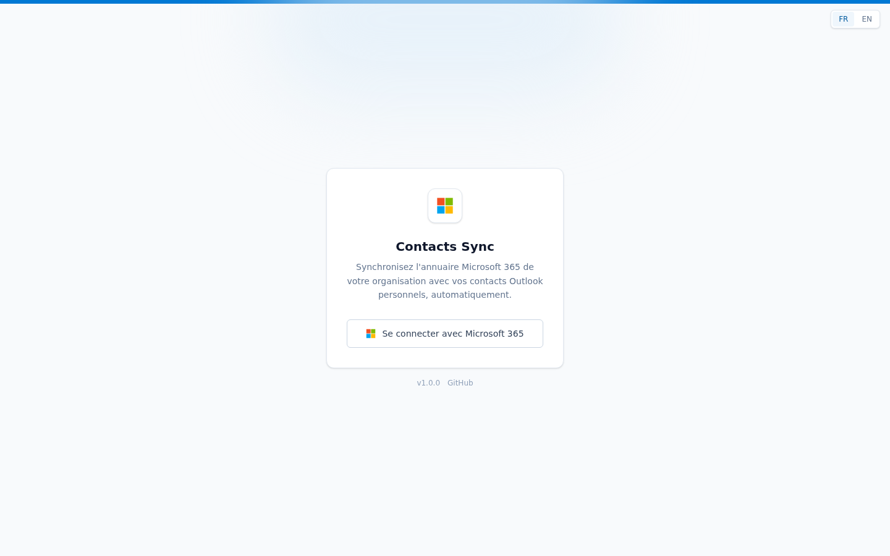

# Contacts Sync

*[Version française](README-fr.md)*

Laravel application that lets each user sign in with Microsoft 365 SSO and sync people from
their organization's directory (Microsoft Graph) into **their own personal Outlook Contacts
folder** - manually, automatically via department/job-title rules, or by syncing the entire
directory in one click.



## Why?

The point of this project is simple: have the company's contact cards on your phone
**effortlessly**, without ever adding or updating them yourself.

This app automatically drops company contacts into Outlook. And since the **Microsoft Outlook**
app on your phone can sync its contacts to the phone's contact list, those cards (name, job
title, phone number...) show up directly in your phone's contacts - recognized by caller ID, the
dialer, messaging apps - with nobody typing anything in, and always kept up to date
automatically.

For this to work, just turn on one setting in the Outlook app (once per phone):

- **iPhone**: Outlook → profile picture → ⚙️ Settings → Contacts → turn on
  **Save Contacts**.
- **Android**: Outlook → ☰ menu → ⚙️ Settings → Contacts → turn on
  **Sync Contacts**.

## How it works

- Microsoft Entra ID (Azure AD) SSO via Laravel Socialite.
- A local cache of the M365 directory (`directory_users`), refreshed by paginating the Graph
  `/users` endpoint (at most every 15 minutes). Only people with a usable **mobile or business
  phone number** are kept - everyone else is skipped, and removed if they had been imported
  previously.
- Three ways to choose who gets synced, combinable, with a clear priority order:
  1. **Manual per-person selection** (`sync_selections`, source `manual`) - a manual opt-out
     always wins, even if a rule or "sync everything" also matches that person.
  2. **Automatic rules** (`sync_rules`) by department and/or job title (exact match or
     "contains").
  3. **"Sync the entire directory"** (`users.sync_all_enabled`): an all-or-nothing switch per
     user, which takes priority over rules (rules then become redundant, which the UI flags).
- A change to first name, last name, job title, department, or phone number in the M365
  directory updates the already-created Outlook contact (no duplicates). Someone who leaves the
  directory, or whose contact was manually deleted in Outlook, has their contact deleted or
  recreated automatically on the next sync.
- Any user action (toggling a person, creating/editing/deleting a rule, enabling "sync
  everything") triggers an immediate background sync, in addition to the automatic 15-minute
  cycle.
- If a user's Microsoft token can no longer be refreshed (refresh token expired or revoked on
  Microsoft's side), the application detects it - either when the refresh itself fails, or as
  soon as a Graph call is rejected with a 401 even though the token still looked valid locally -
  and shows a "reconnection required" banner on every page until the user signs in again.
- Full history of creations/updates/deletions/errors (`sync_logs`), visible in the History tab.
- Interface available in **French and English**, with a language switcher (login page and
  sidebar). The preference is saved on the user's account (`users.locale`) once signed in, so it
  persists across sessions; before signing in, it's only kept in the browser (`localStorage`).

## Requirements

- A Microsoft Entra ID (Azure AD) tenant where you can register an application and grant admin
  consent.
- Docker and Docker Compose (recommended install path), **or** PHP 8.3+, Composer, and Node.js
  for a local install.

## 1. Register the Azure AD application (Microsoft Entra ID)

1. On [entra.microsoft.com](https://entra.microsoft.com) (or portal.azure.com > Microsoft Entra
   ID), go to **App registrations** > **New registration**.
2. Name: `Contacts Sync` (or anything you like).
3. Account type: depends on your needs (usually *Accounts in this organizational directory
   only* for a single tenant).
4. **Redirect URI**: type `Web`, value `https://domain.com/auth/callback` (or
   `http://localhost:8080/auth/callback` locally).
5. Once created, note down:
   - **Application (client) ID** → `MICROSOFT_CLIENT_ID`
   - **Directory (tenant) ID** → `MICROSOFT_TENANT_ID`
6. **Certificates & secrets** > **New client secret** → note the value (shown only once) →
   `MICROSOFT_CLIENT_SECRET`.
7. **API permissions** > **Add a permission** > **Microsoft Graph** > **Delegated permissions**,
   add:
   - `openid`, `profile`, `email`, `offline_access` (often present by default)
   - `User.Read`
   - `User.Read.All` *(requires tenant admin consent - this is what lists the directory's
     accounts, not `OrgContact.Read.All`, which covers external organizational contacts, out of
     scope for this app)*
   - `Contacts.ReadWrite`
8. Click **Grant admin consent for {tenant}** (requires a tenant admin role). Without this
   consent, reading the full directory (`User.Read.All`) fails for non-admin users.

No **Application** permission (client credentials) is needed: everything is **Delegated**, each
user syncing with their own account/token.

## 2. Install with Docker (recommended)

The published image (`ghcr.io/jturazzi/contacts-sync`) bundles the app with all PHP
dependencies and pre-built frontend assets - no local PHP/Node toolchain needed.

1. Download `docker-compose.yml` from this repository (or copy it from the repo root).
2. Fill in the `environment:` blocks of all three services (`app`, `queue`, `cron`) with your
   own values:

   ```yaml
   environment:
     APP_URL: "https://your-domain"
     APP_KEY: "base64:...."          # see below - do not skip this
     MICROSOFT_CLIENT_ID: "..."
     MICROSOFT_CLIENT_SECRET: "..."
     MICROSOFT_REDIRECT_URI: "https://your-domain/auth/callback"
     MICROSOFT_TENANT_ID: "..."
   ```

   > **`APP_KEY` is required and must stay stable.** Access and refresh tokens are stored
   > **encrypted** in the database using this key. Generate one **once** - for example by running
   > `docker run --rm ghcr.io/jturazzi/contacts-sync php artisan key:generate --show` - then reuse
   > the exact same value on every service and on every redeploy. If the key ever changes, every
   > stored Microsoft token becomes unreadable and all users must reconnect.

3. By default the app uses **SQLite**, stored inside the `storage-data` volume, so no separate
   database container is required. To use MySQL/MariaDB instead, add the usual `DB_*` variables
   (`DB_CONNECTION=mysql`, `DB_HOST`, `DB_DATABASE`, `DB_USERNAME`, `DB_PASSWORD`) to the
   `environment:` block of all three services and point them at your own database server.
4. Start everything:

   ```bash
   docker compose up -d
   ```

   The `app` container serves the application (FrankenPHP) and runs pending database migrations
   automatically on startup. The `queue` container processes sync jobs, and the `cron` container
   runs the Laravel scheduler (which triggers `sync:run-all` every 15 minutes) - **both are
   required** for synchronization to actually happen; the `app` container alone only serves pages.
5. Open `http://localhost:8080` (or whatever port you mapped via the `PORT_APP` environment
   variable, e.g. `PORT_APP=9000 docker compose up -d`).

### Updating

```bash
docker compose pull
docker compose up -d
```

Pending migrations run automatically when the `app` container restarts.

## 3. Local development install (without Docker)

```bash
composer install
npm install
cp .env.example .env
php artisan key:generate
php artisan migrate
npm run build   # or `npm run dev` while developing
php artisan serve
```

Fill in the same `MICROSOFT_*` variables described above in your local `.env` file.

### Background jobs (local / bare-metal deployment only)

If you're not using the `queue` and `cron` Docker services, two processes must run
continuously:

- **The queue worker**, which runs sync jobs (the job manages its own retries and timeout, so
  don't override them on the command line):
  ```bash
  php artisan queue:work
  ```
  Supervise it with `supervisor` or a `systemd` service in production so it restarts itself on
  crash or terminal closure - a manually-run worker is fragile: any interruption mid-job (Ctrl+C,
  closing the session) leaves the sync half-done.

- **The Laravel scheduler**, which triggers `sync:run-all` every 15 minutes for every user with
  a selection, an active rule, or "sync everything" enabled. Add this crontab entry:
  ```
  * * * * * cd /path/to/contacts-sync && php artisan schedule:run >> /dev/null 2>&1
  ```

Toggling a person in the directory and creating/editing a rule both go through the queue
(asynchronously) - the page responds immediately, and the actual sync runs in the background as
soon as the worker picks it up.

## Tests

```bash
php artisan test
```

Covers rule-matching and "sync everything" logic (`RuleMatcher`), directory import with phone
filtering and pagination (`DirectoryService`, Graph mocked via `Http::fake()`), and the sync
engine (`ContactSyncService`): creation, update on field change, deletion after leaving the
directory, recreation of a contact manually deleted in Outlook, and manual opt-out taking
priority over a rule or over "sync everything".

## License

[MIT](LICENSE).
